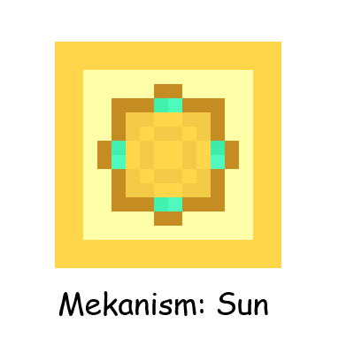

# Mekanism: Sun

Produce a huge amount of FE using an artificial sun!

The structure of the artificial sun is the same as that of the SPS.

This mod does not strictly depend on ProjectE and ProjectExpansion, but not installing them will cause the Artificial Sun Casing and Artificial Sun Port to lose recipes and the appropriate harvesting tools, requiring custom recipes and tags.

## For modpack authors
The Artificial Sun also has the function of keeping the world permanently daytime and sunny (no activation needed)! You can modify the Artificial Sun Port's recipe so that players only use this feature.

_This introduction is translated from Chinese._